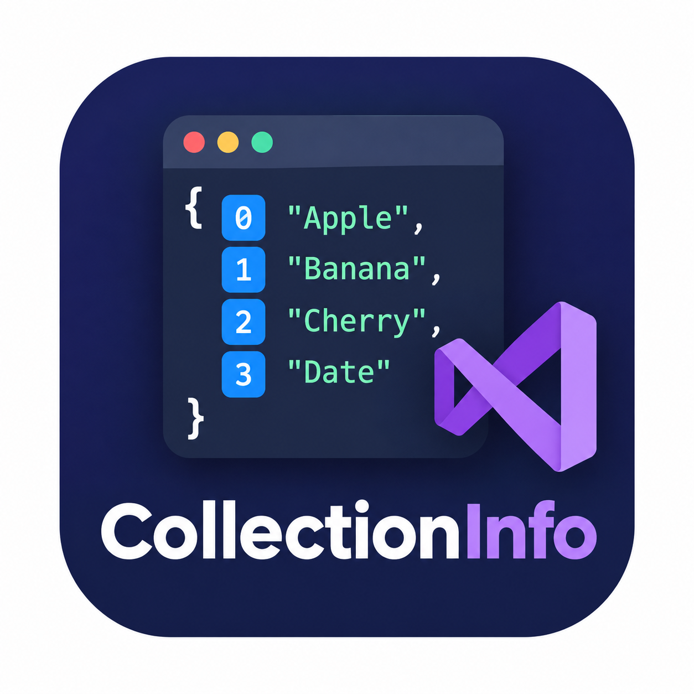
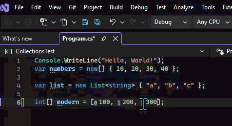

# CollectionInfo
<p align="center">
  
</p>

**CollectionInfo** is a Visual Studio extension for C# developers that displays the index of an item when the caret is positioned on an element of a collection initializer.

## Overview

When working with collection initializers such as:

```csharp
List<int> source = [10, 5, 3];
```

CollectionInfo is designed to show the corresponding zero-based index:

```text
10  → 0
5   → 1
3   → 2
```

The goal is to make collection positions easier to identify without manually counting elements.

## Features

- Displays zero-based collection item indexes in the editor.
- Works with C# collection initializer syntax.
- Provides index information directly in the code editor.
- Uses Visual Studio's editor and C# language-service infrastructure.
- Designed to remain unobtrusive while programming.

## Example

<p align="center">
  
</p>

Given:

```csharp
var numbers = new List<int>
{
    10,
    5,
    3
};
```

CollectionInfo can indicate:

```text
10 → 0
5  → 1
3  → 2
```

## Requirements

- Visual Studio Community 18.x or compatible Visual Studio 2026 installation.
- C# development workload.

## Intended Use

CollectionInfo is useful when working with:

- `List<T>`
- Collection initializers
- Array-like collection data
- Large collections where manually counting positions is inconvenient
- Code where knowing an item's zero-based position is useful during development

## License

MIT License
